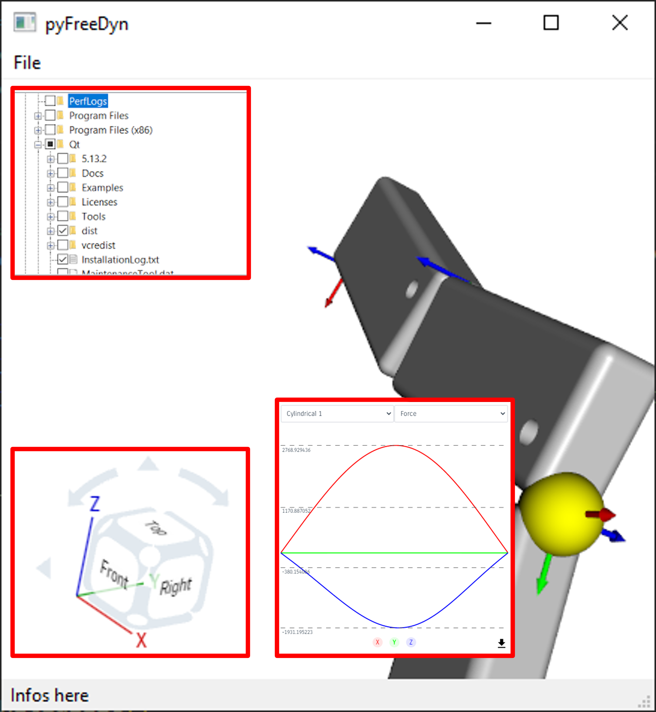

# **Abschlussaufgabe**

## **Ziel**
Erarbeitung einer Qt-Anwendung (PySide6) mit Integration von VTK.

---

## **Aufgabenstellung**
Für den Abschluss der LVA VIS3 ist die Einreichung einer Abschlussaufgabe obligatorisch. Es bestehen dazu zwei Möglichkeiten, die im Folgenden erklärt werden.

### **1. Projekt aufbauend auf bestehenden, während des Semesters erarbeiteten Modulen**
Nutzen Sie die aus `/VIS_2024/Aufgabe_3` erarbeiteten Module.

- **Was muss das Programm/Script können?**
  - Einlesen eines (FreeDyn) Inputfiles (via Menü).
  - Darstellen der Inhalte/Elemente im 3D-Fenster.
  - Mindestens eine zusätzliche Funktion:
    - Überlegen Sie sich eine sinnvolle zusätzliche Funktion, die für einen Pre-/Postprocessor interessant sein könnte:
      - Zusätzliche Widgets (Tree Widget, Menüs, etc.).
      - Zusätzliche 3D-Props (mitdrehendes Koordinatensystem, Hintergrund, etc.).
      - Animation von Bewegungen.
      - 2D-Elemente wie ein XY-Plot.
      - etc.
    - Wichtig ist: Bringen Sie Ihre **eigene Idee** ein!

### **2. Umsetzung einer eigenen Idee**
Ziel der LVA ist/war es, Ihre Fähigkeiten in Bezug auf Umsetzung von Programmideen im Engineering-Umfeld zu stärken. Es ist daher auch explizit erlaubt, eine eigene Projektidee einzubringen und diese im Rahmen des Abschlussprojekts umzusetzen.

- **Voraussetzung:**
  Kontaktieren Sie mich vor Beginn der Arbeit und wir besprechen den erwarteten Umfang und die Komplexität. Dies ist wichtig, um sicherzustellen, dass der Aufwand mit den Arbeiten gemäß Punkt 1 vergleichbar ist.

- **Denkanstöße:**
  - FEM/CFD Pre-/ oder Postprocessor.
  - Minimales Computerspiel mit Visualisierung und Physiksimulation.
  - Werkzeuge für Datenanalyse (z. B. 3D-Scatterplot mit auswählbaren Datenpunkten).
  - Visualisierung physikalischer Prozesse (z. B. Partikelsysteme, Fluidströmungen).

---

## **Abgabe**
Reichen Sie die Lösung **bis zum 22. Jänner 2025 vor Ihrem Termin für das Abschlussgespräch** per Pull-Request ein. Die Einteilung zu den Abschlussgesprächen wird noch bekanntgegeben.

### **Abgabekriterien:**
- Die Abgabe sollte vollständig lauffähig und ausreichend dokumentiert sein (z. B. `README.md` mit Installationsanleitung).

---

## **Bewertungskriterien**
- **30 %:** Funktionalität und Vollständigkeit.
- **30 %:** Code-Qualität (Lesbarkeit, Modularität, Kommentare).
- **20 %:** Benutzerfreundlichkeit und GUI-Design.
- **20 %:** Kreativität und Innovation.

---

## **Abschlussgespräch**
Im Abschlussgespräch sollten Sie Ihre Lösung präsentieren können (ca. 5-10 Minuten) und auf Fragen zu Ihrem Code und Konzept eingehen können.
