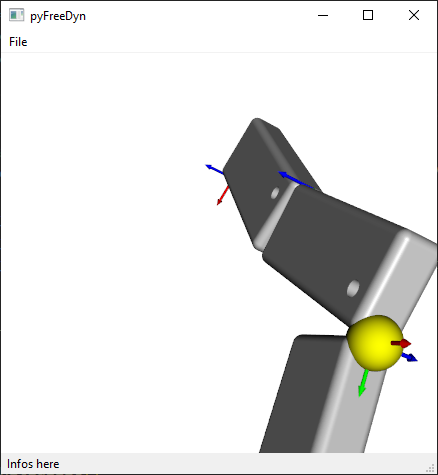

# **Aufgabe 3: Integration der 3D-Ansicht in eine GUI**

## **Ziel**
Erarbeitung einer Qt-Anwendung (PySide6) mit Integration von VTK.

---

## **Aufgabenstellung**

### **1. Verwendung bestehender Module**
Nutzen Sie die in `/VIS_2024/Aufgabe_2` bereitgestellten Module, wie `mbsObject`, `mbsModel` usw.

### **2. Erstellung einer Qt-Widgets-Anwendung**
Implementieren Sie eine Anwendung mit den folgenden **Mindestanforderungen**:
- **Menüleiste** mit den Einträgen:
  - `File/Load`
  - `File/Save`
  - `File/ImportFdd`
  - `File/Exit`
- **Statusleiste**, die eine Übersicht über das geladene Modell anzeigt.
- **Zentrales Widget**: Integration eines VTK `RenderWindow`.

### **3. Einlesen eines Modells über File/ImportFdd**
- Implementieren Sie einen Dateidialog, mit dem der Benutzer den Pfad zu einer `.fdd`-Datei auswählen kann.
- Nutzen Sie den `inputfilereader`, um aus der `.fdd`-Datei ein `mbsModel` zu erstellen.

### **4. Speichern und Laden von Modellen**
- **Speichern:** Speichern Sie die Modellelemente in einer JSON-Datei.
- **Laden:** Lesen Sie die Modellelemente aus einer JSON-Datei ein und erstellen Sie daraus ein `mbsModel`.

### **5. Darstellung des Modells im VTK-Fenster**
- Stellen Sie die `mbsObjects` (deren `vtkActors`) im VTK-Fenster dar.
- Nutzen Sie hierzu die `show()`-Methode.

---

## **Abgabe**
Reichen Sie die Lösung **bis zum 18.12.2024 vor der Lehrveranstaltung** per Pull-Request ein.
